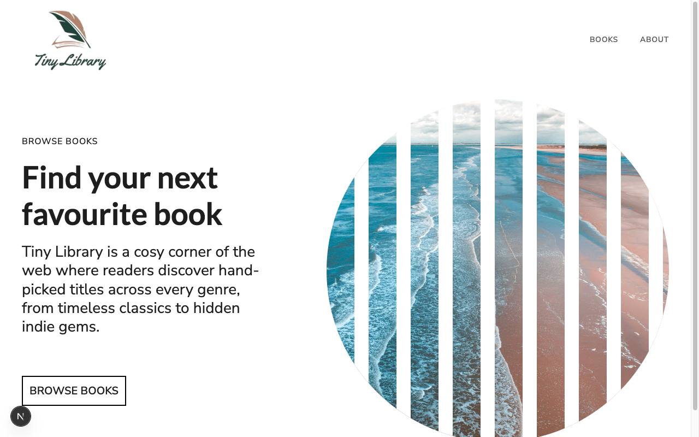

# Tiny Library

A small book-browsing web app built to practice **Next.js (App Router) and
TypeScript**. A styled landing page invites readers to browse a hand-picked catalog,
with a dedicated `/books` route for the collection.



## Features

- Next.js App Router with a styled hero landing page.
- A `/books` route for browsing the library catalog.
- TypeScript throughout, with shared types in `types/`.
- Tailwind CSS styling.

## Tech stack

**Next.js** · React · **TypeScript** · Tailwind CSS

## Getting started

```bash
npm install
npm run dev          # http://localhost:3000
```

Other scripts: `npm run build`, `npm run start`, `npm run lint`.

> ⚠️ This repo pins a recent **Next.js** whose APIs may differ from older versions
> (see [`AGENTS.md`](AGENTS.md)).

## What I practiced

Setting up a **typed Next.js App Router** project from scratch — routing between pages,
sharing TypeScript types, and styling with Tailwind.

## License

Scrimba practice project — original implementation by Aziz Umarov.
